Tourism Agency System

This will be a quick guide to this project.

You can find the SQL code required to set up the schema and tables in sql_queries.txt.

This is an Entity Relation Diagram describing the relations between the various tables in the schema.

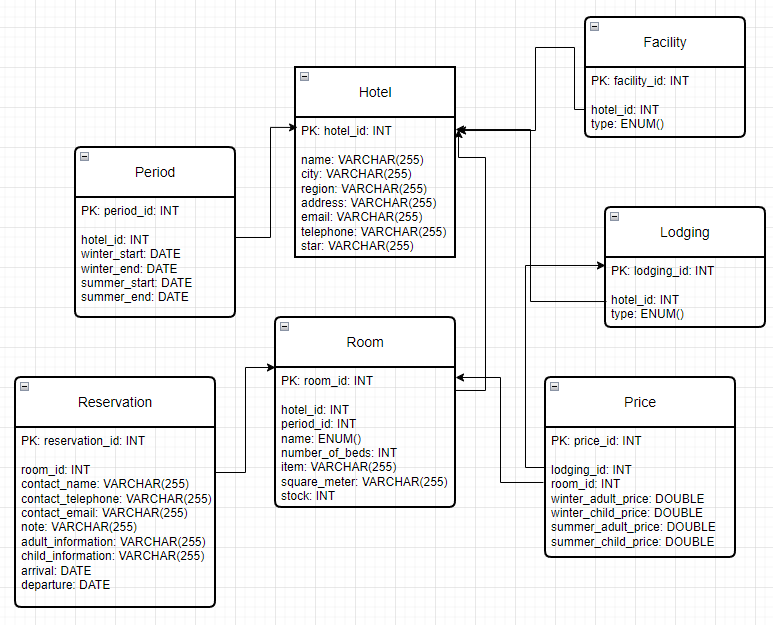

The entrance of the program is App.java. The theme is configurable with "Utility.setTheme()",

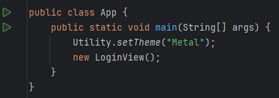

You must log in to access the system. You can log in either as an admin or agent. An admin has the role of managing users
while an agent has the role of managing the information related to hotels.

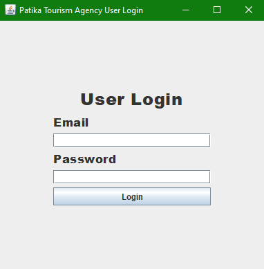

You can right-click on users in the table to update or delete them.

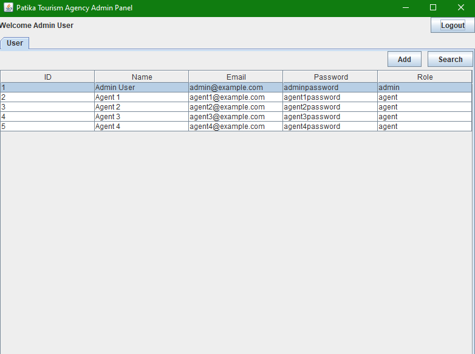
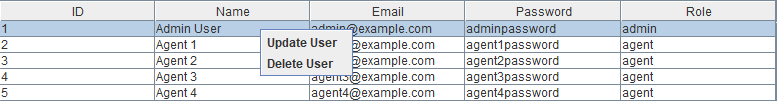

Clicking on "Add":

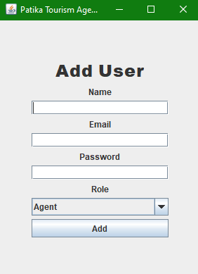

Clicking on "Search":

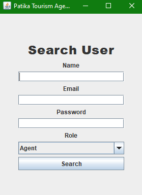

Clicking on "Logout" brings you back to the Log in screen.

The agent panel features 3 tabs pertaining to different aspects of the hotel management process:
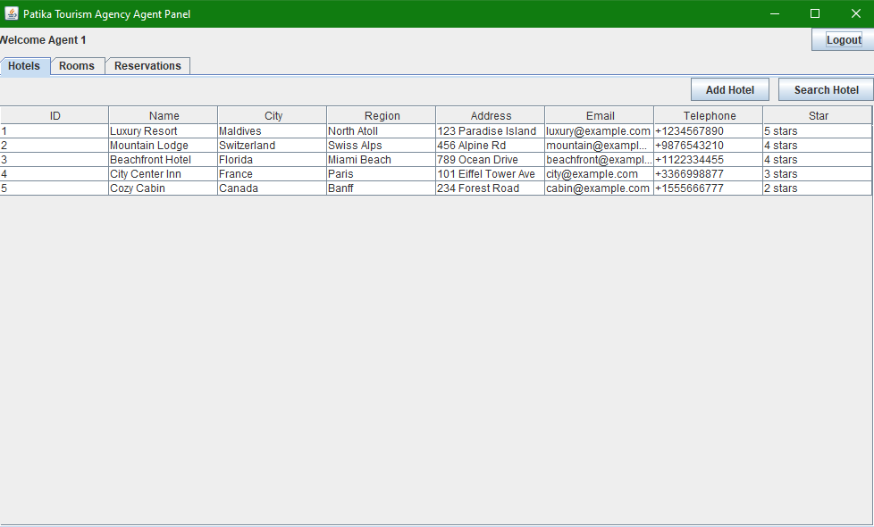
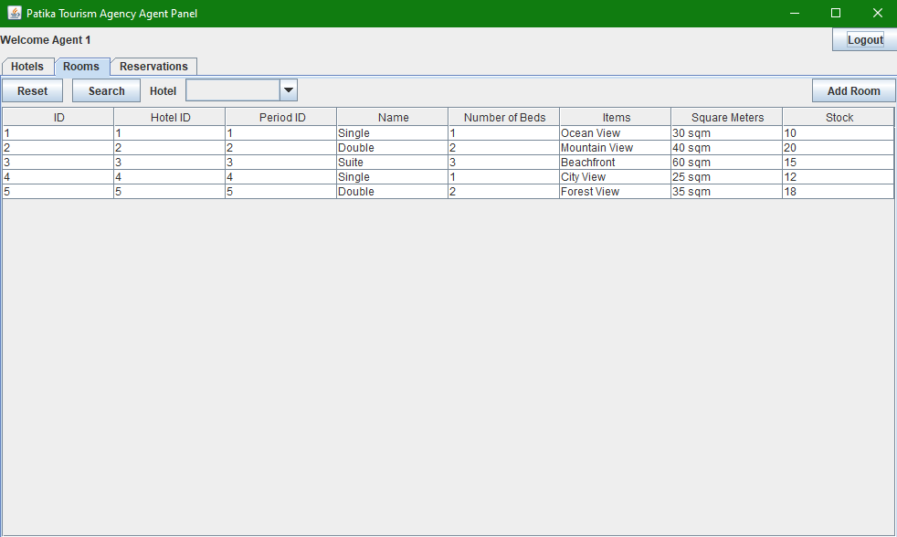
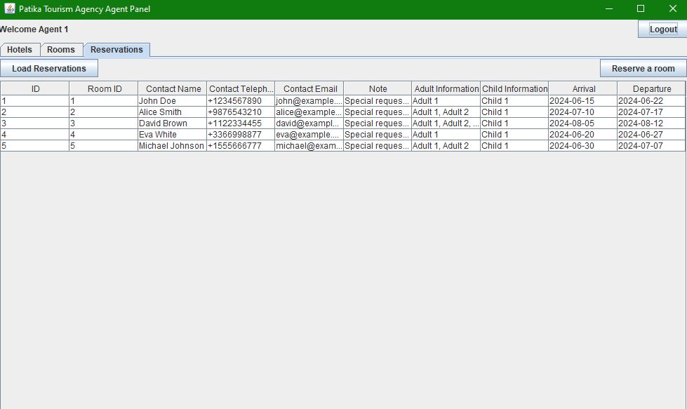

Hotel Tab:

Similar to the admin panel, the hotel tab features adding and searching popups when clicked:
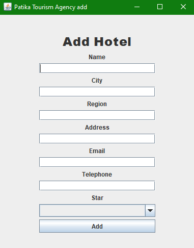
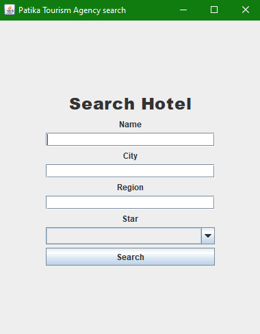

Right-clicking on a hotel in the table provides the 5 options: "Update," "Delete," "Access Facility Specs," 
"Access Lodging Options," and "Access Hotel Periods."

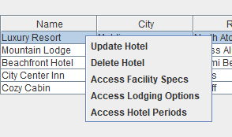

The room tab filters rooms based on their hotel. You can do this through the use of this combo box:

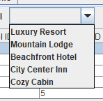

Clicking on "Add":

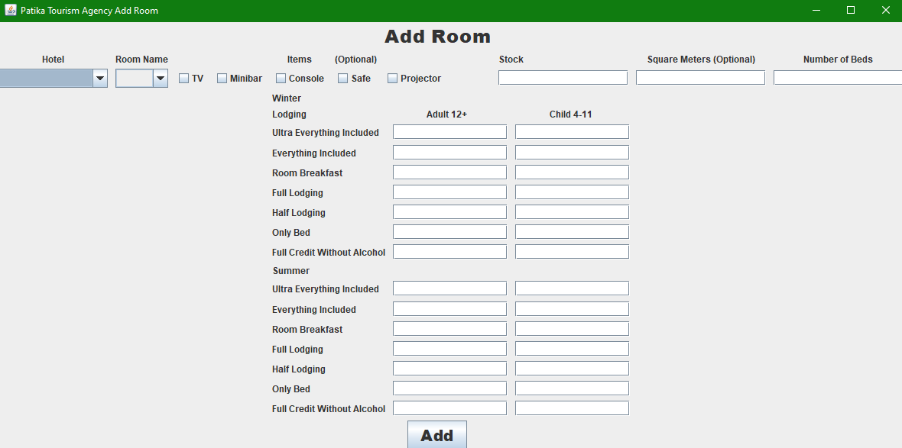

Right-clicking on "Update":

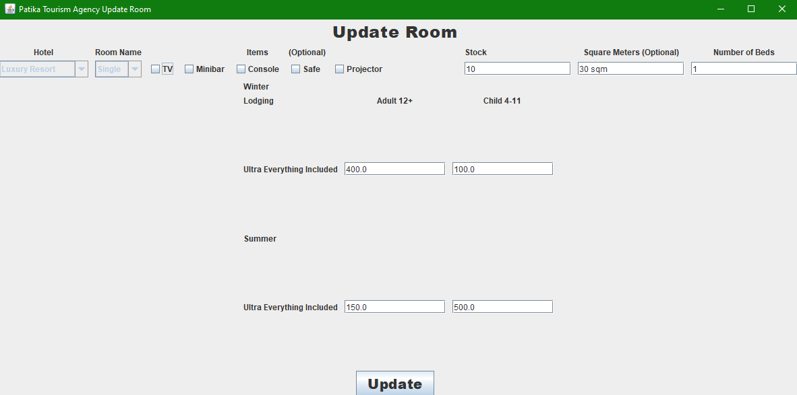

The reservation tab allows the agent to view previous reservations, delete them, and reserve a room for the customer by 
inputting certain criteria. 

Clicking on "Reserve a room" (valid dates are in yyyy-MM-dd format):

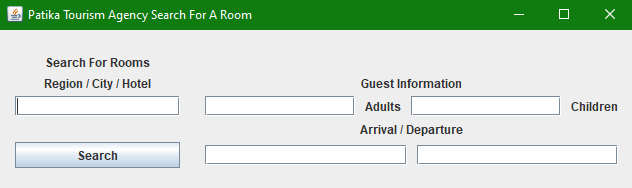

Based on the input, you receive all possible lodging options for each suitable room:

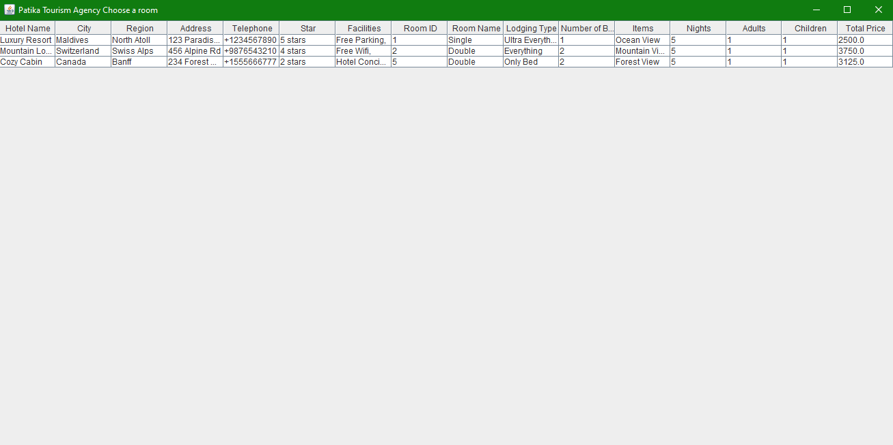

You can reserve one of these rooms by right-clicking on them.

As the last step, you must enter guest information:

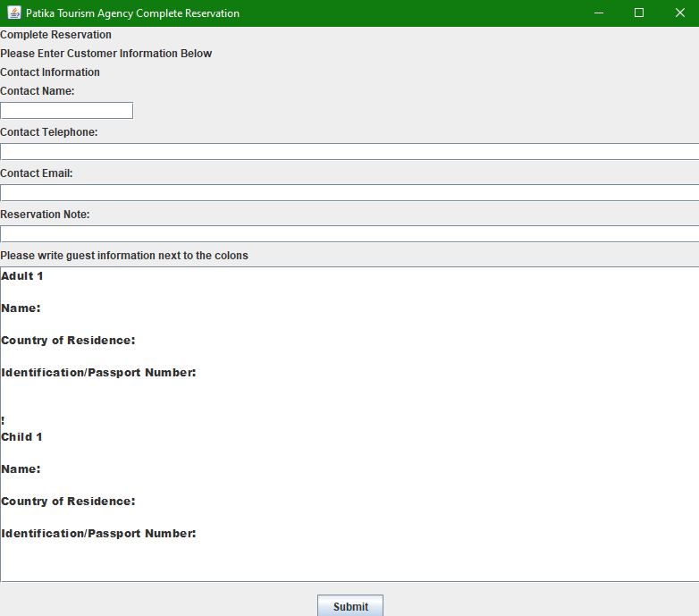

Reserving a room decreases its stock by one and deleting a reservation increases the reserved rooms stock by one.